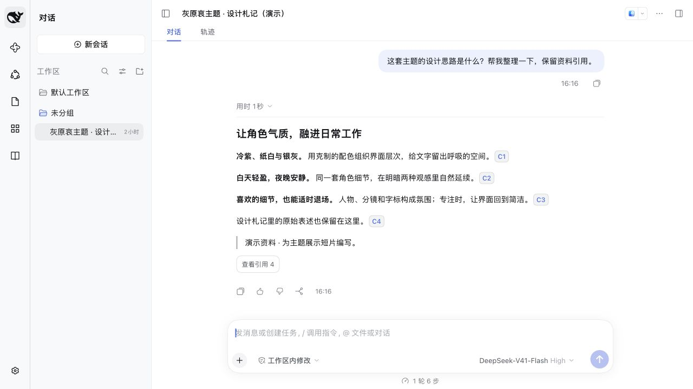
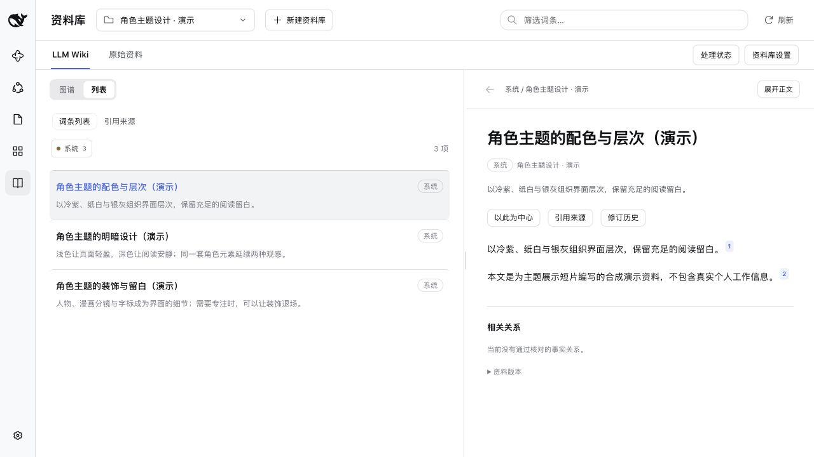
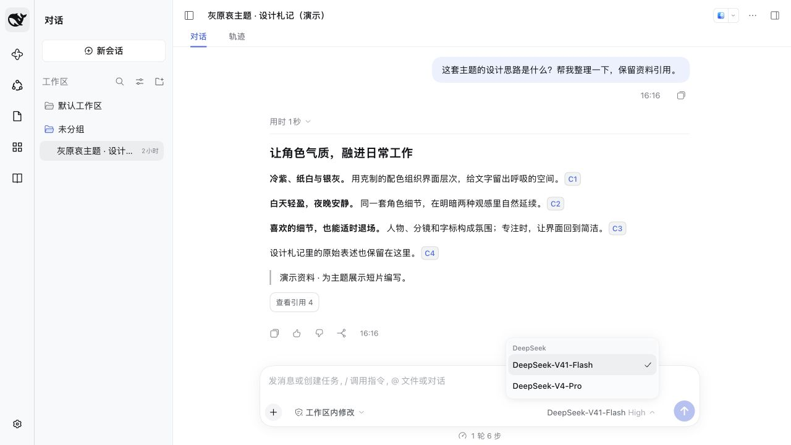

# Workbench 导航

为 DeepSeek Harness Web 带来紧凑的应用导航，让应用切换与对话列表各有位置。

**当前版本 1.11.2** · 官方 Harness **0.1.7-rc.2** · Node.js **24**

[看界面](#应用与对话各有位置) · [快速安装](#快速安装) · [搭配主题](#与主题搭配) · [常见问题](#常见问题与兼容性) · [npm](https://www.npmjs.com/package/dsh-workbench-shell)

## 应用与对话，各有位置

左侧的 **56px 应用栏**集中放置应用入口，对话列表独立展开。应用、会话和正文形成清楚的层次，查看已有对话时不用离开当前工作区。



> 截图使用导航 1.11.2、官方 DSH 0.1.7-rc.2，未启用角色主题。应用入口和引用示例来自其他独立插件，内容为合成演示资料；它们用于展示导航布局，不是导航包附带的业务能力。

对话页顶部可随时展开或收起列表：找会话时展开，专注阅读时收起。导航复用官方的语义颜色和控件，单独安装即可使用。

## 切换应用，接着聊

从对话进入其他应用，再点左侧的**对话入口**返回，仍然停留在原会话。进入应用时保留侧栏宽度偏好，不用每次切换都重新整理布局。



*截图中的应用内容由对应插件提供；Workbench 导航负责入口与布局，不包含这些应用的业务功能。*

## 更清楚的聊天模型菜单

对话模型菜单与 `/model` 共用聊天用途目录：保留文本聊天和支持图片输入的聊天型号，筛除向量、重排及明确的生图、视频专用型号。原生推理等级和当前选择保留。



模型设置页、资料库用途和创作画布仍读取完整模型目录。筛选依据型号标识与名称中的专用用途标记；具体边界见下方兼容说明。

## 快速安装

需要已安装的官方 `@deepseek-ai/dsh@0.1.7-rc.2` 和 **Node.js 24**。先停止目标 Web Profile，再在同一个环境中安装并启动：

```sh
dsh plugin --profile web add dsh-workbench-shell
dsh web
```

如果平时使用自定义数据目录，安装和启动都要使用相同的 `DSH_HOME`。

首次打开后，可以这样体验：

1. 找到左侧应用栏，进入一个已有应用，再点顶部对话入口返回原会话。
2. 在对话页顶部展开、收起对话列表，观察主内容区的变化。
3. 打开对话模型菜单，或输入 `/model` 查看聊天型号。

<details>
<summary>安装到指定数据目录，或使用本地安装包</summary>

先将路径替换为实际目标目录，再执行：

```sh
export DSH_HOME="/绝对路径/你的-dsh-数据目录"
dsh plugin --profile web add dsh-workbench-shell
dsh web
```

已有本地构建产物时，也可以安装 `.tgz` 文件：

```sh
dsh plugin --profile web add /绝对路径/dsh-workbench-shell-1.11.2.tgz
```

`DSH_HOME` 决定安装所用的数据目录；`--profile web` 指定 Web Profile。它们应与日常启动使用的设置一致。

</details>

## 与主题搭配

导航和外观可以分开选择。喜欢灰原哀风格的明暗配色、人物装饰、字标与 APTX 标志，可以再安装 [Workbench 主题](https://github.com/lucky01222/dsh-workbench-theme)。

| 插件 | 负责的体验 |
| --- | --- |
| **Workbench 导航** | 应用栏、独立对话列表、切换与展开收起、聊天模型菜单筛选 |
| **Workbench 主题** | 配色、字标、品牌标志、角色装饰与外观设置 |

两者可以独立安装，也支持任意安装顺序。停用主题后，导航仍可使用，并回到官方 FishLogo；停用导航后，主题仍然保留。外观选项统一由主题插件提供。

## 常见问题与兼容性

### 支持哪个版本？

当前适配官方 **DeepSeek Harness Web 0.1.7-rc.2**。宿主升级后需要重新核对布局和模型目录的适配；原生桌面标题栏不应用此 Web 导航。

### 安装后为什么没有人物或其他应用？

角色配色与装饰来自独立主题；资料库、文档工作台等应用需要各自安装。导航可以单独运行，也不依赖主题包。

### 模型菜单筛选会改动模型配置吗？

不会。它只调整对话模型菜单和 `/model` 返回的目录，其他用途仍可使用完整模型列表。当前宿主没有输出模态或用途字段，筛选采用型号标识与名称中的专用用途标记，因此不应把它理解为对所有型号能力的自动识别。

### 如何恢复官方导航？

停止目标 Profile，在同一个 `DSH_HOME` 下卸载，再重新启动：

```sh
dsh plugin --profile web remove dsh-workbench-shell
dsh web
```

重启后恢复官方导航。已有文档、会话与其他业务插件不受影响。

<details>
<summary>实现边界与清理机制</summary>

- 模型筛选绑定 rc.2 的 `sessionController.modelCatalog` 方法，不以 `inputModalities: text` 判断聊天资格。卸载时恢复原方法，不覆盖后来安装的适配，也不修改官方发行包。
- rc.2 没有公开的侧栏宽度 setter，本插件只投影原生 frame 的首轨宽度，不改原生布局偏好、业务数据或会话状态。
- 导航声明可选的 single/root 子槽 `workbench.brand.mark`，owner 为 `{size, className?}`。主题通过官方槽生命周期贡献标志；导航不引用主题包，也不渲染人物门户。
- 旧外观配置 schema 只为升级迁移保留，不注册外观设置行或应用配色。
- 停用时释放自己创建的样式、标记、观察器和子槽。Client 样式在插入页面前标记所属插件，其他插件加载或热更新不会误移除本插件的 CSS。

</details>

## 开发

```sh
npm ci
npm run build
npm run check
npm test
npm pack
```

测试覆盖路由、宽度偏好、原生品牌回退、清理和聊天模型筛选。

<details>
<summary>运行 rc.2 客户端生命周期回归</summary>

构建后指定官方运行时目录：

```sh
DSH_RUNTIME_ROOT=/path/to/official-runtime npm run test:client
```

与主题配对的测试需要主题的构建产物，可用 `DSH_PEER_PACKAGE_ROOT` 指向它的独立目录。测试在真实 rc.2 Loader/Cordis 下覆盖其他插件热更新、自身启停恢复、旧实例释放与两种加载顺序；使用内存 DOM，不代替浏览器界面验收。

仓库中保留的早期主题源码和测试属于开发历史，不进入导航客户端。现行主题与相关迁移测试在独立主题仓库维护。

</details>

## 许可

代码以 [MIT 许可](LICENSE) 发布。`src/assets` 中保留的图片不在 MIT 代码许可范围内，来源与权利说明见 [THIRD_PARTY_NOTICES.md](THIRD_PARTY_NOTICES.md)。

README 截图的环境与内容说明见 [展示素材记录](media/SOURCES.md)。
